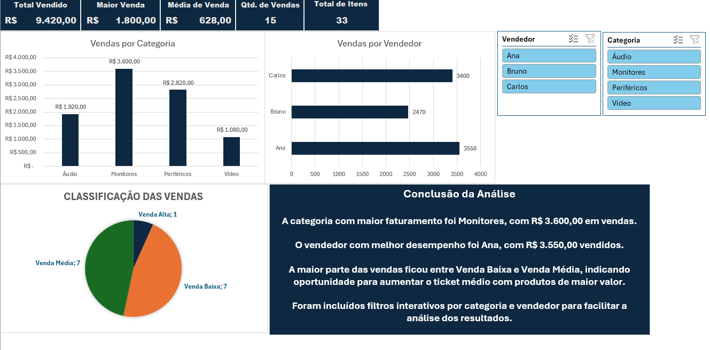

# Análise de Vendas com Dashboard em Excel

Este projeto apresenta um dashboard de análise de vendas desenvolvido no Microsoft Excel, simulando uma demanda real de cliente para acompanhamento de desempenho comercial.

## Objetivo

Transformar uma base simples de vendas em um painel visual e interativo, permitindo analisar faturamento, desempenho por categoria, desempenho por vendedor e classificação das vendas.

## Painel visual

## Indicadores apresentados

- Total vendido
- Maior venda
- Média de venda
- Quantidade de vendas
- Total de itens vendidos

## Análises realizadas

- Vendas por categoria
- Vendas por vendedor
- Classificação das vendas por valor
- Identificação da categoria com maior faturamento
- Identificação do vendedor com melhor desempenho
- Análise de oportunidade para aumento do ticket médio

## Ferramentas utilizadas

- Microsoft Excel
- Fórmulas
- Função SE
- Tabela Dinâmica
- Gráficos
- Segmentação de Dados
- Formatação de Dashboard

## Conclusão da análise

A categoria com maior faturamento foi Monitores, com R$ 3.600,00 em vendas.

O vendedor com melhor desempenho foi Ana, com R$ 3.550,00 vendidos.

A maior parte das vendas ficou entre Venda Baixa e Venda Média, indicando oportunidade para aumentar o ticket médio com produtos de maior valor.

Foram incluídos filtros interativos por categoria e vendedor para facilitar a análise dos resultados.

## Arquivo do projeto

O arquivo Excel está disponível neste repositório:

`analise-vendas-cliente.xlsx`
